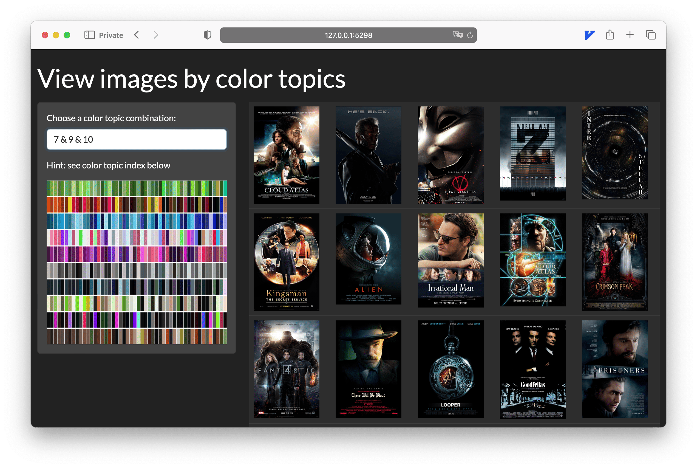

# ChromaClust

Image color topic modeling using
[fastTopics](https://github.com/stephenslab/fastTopics).

The original idea is from my final project for the course
HG48600: Fundamentals of Computational Biology: Models and Inference
([poster](https://nanx.me/posters/chromaclust-poster-hg48600.pdf)).

## Reproducibility

This project uses [renv](https://rstudio.github.io/renv/) to ensure reproducibility. The dependency information is store in `renv.lock`.

Run `renv::restore()` to restore the exact version of dependencies
from `renv.lock`. This will create a project-specific library under
`renv/` and create an `.Rprofile` to use that library when the project
is opened.

## Directory structure

- `R/`: R scripts used for the project. Files are named with numerical
  prefixes, indicating the order in which they should be executed for
  successful run-through.
- `output/`: Saves model snapshots for future reference or reuse.
  Also, important intermediate results generated during data
  preprocessing and model training and stored here.
- `images/`: All graphical outputs generated during the analysis,
  primarily aimed at visualizing the model's performance and
  characteristics, are stored here.
- `data/`: Stores the input dataset used in the project.
  See below on the example data.

## Data

todo

## Image viewer by color topics

A minimal Shiny app is built for easy review of images under
the same color topic or mixture of topics.
To use the app, open the project and run through `R/5-exemplar.R`.

The example below shows a pattern from the combination of
three color topics:

- Dark color background (topic 7).
- High contrast color title (topic 9).
- Protagonist with skin color shown in the foreground (topic 10).

